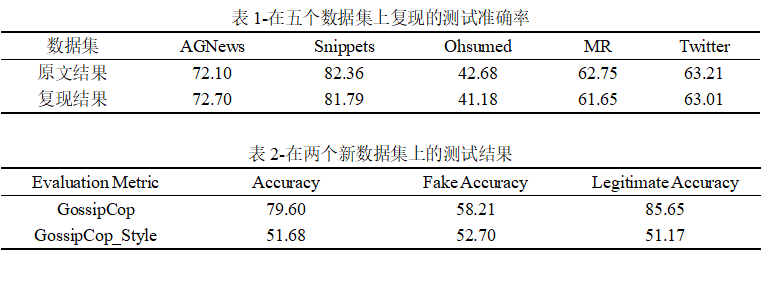
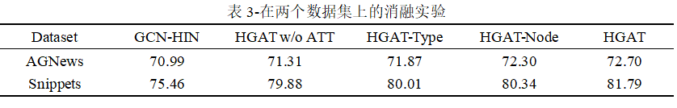
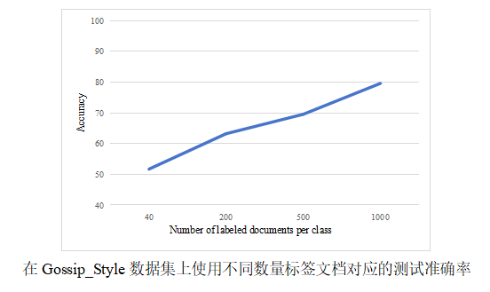

机器学习大作业项目
=======
学号：2310273064 姓名：csh

An implement of paper "[HGAT: Heterogeneous Graph Attention Networks for Semi-supervised Short Text Classification](https://doi.org/10.1145/3450352)"  (TOIS 2021). 

# Requirements

- Anaconda3 (python 3.6)
- Pytorch 1.3.1
- gensim  3.6.0

# Result

